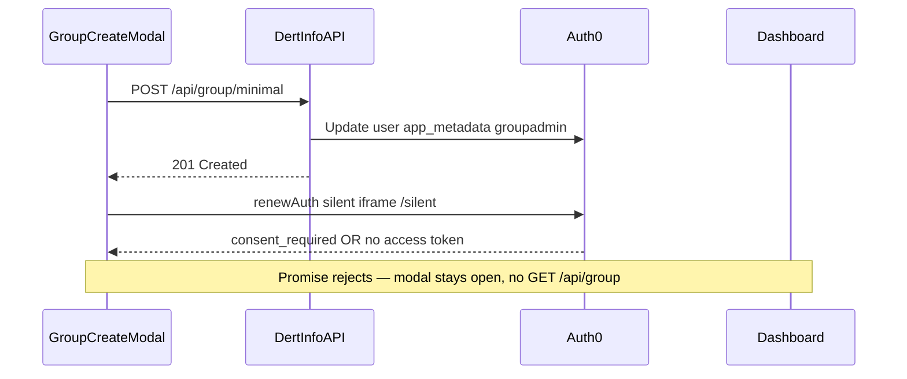

# Investigation: Local silent auth fails on localhost after group create

**Status:** Diagnosis complete — deferred while monorepo stabilisation continues. Acceptable interim: re-login after group create on `http://localhost:44200`. Future work may include HTTPS local dev hostname, Codespaces/tunnel callbacks, or auth library updates — without changing production auth flow until deliberately planned.

**Symptom:** After creating a group locally (`http://localhost:44200`), the create-group modal stays open, the dashboard group list does not refresh, and `GET /api/group` does not run after a successful `POST /api/group/minimal` (201). Production (`https://www.dertinfo.co.uk`) works for the same flow.

**Related:**

- [`docker-silent-auth-investigation.md`](docker-silent-auth-investigation.md) — earlier Docker/static-callback experiments (reverted)
- [`web-warmup-race-condition.md`](web-warmup-race-condition.md) — separate warmup/dashboard 401 issue

---

## What is actually happening

Creating a group locally is **two separate steps** in code:

1. **`POST /api/group/minimal` succeeds** — group is saved in SQL and Auth0 app metadata is updated with the new `groupadmin` claim (`apps/dert-api/src/dertinfo-services/Entity/Groups/GroupCreator.cs`).
2. **`AuthService.renewToken()` fails** — `apps/dert-web/src/client/src/app/modules/dashboard/services/dashboard.conductor.ts` only proceeds after renewal; on failure the modal stays open.

Local group create is **not broken at the API**; it is **blocked in the UI** because the access token in `localStorage` still lacks the new `https://dertinfo.co.uk/groupadmin` claim. Production works because step 2 succeeds there.

Failure occurs with `ng serve` + SWA on `:44200` (not Docker-specific). A lightweight static `/silent` callback was also tried and still returned `consent_required` on localhost — see the Docker investigation doc.

---

## Clarification: this is not a “refresh token” grant

`apps/dert-web/src/client/src/app/core/authentication/auth.service.ts` `renewToken()` calls **`auth0.renewAuth()`** — a hidden iframe to `{callbackUrl}/silent` with `usePostMessage: true` and `prompt=none`.

The app uses **`auth0-js`** (not `@auth0/auth0-angular`). Although login requests `offline_access`, **renewal does not use a refresh_token exchange**.

---

## Root cause

Auth0 returns **`consent_required`** for silent renewal on **`http://localhost:44200`** when requesting audience **`api.dev.dertinfo.co.uk`** with **`prompt=none`**.

[Auth0 documents](https://auth0.com/docs/api-auth/user-consent#skipping-consent-for-first-party-clients) that **first-party consent skipping does not apply to localhost**, even when:

- Allowed Callback URLs include `http://localhost:44200/silent`
- API **Allow Skipping User Consent** is ON (verified on `api.dev.dertinfo.co.uk`)
- Application **First Party** ownership is set (verified for client `JREkJwdUbZmUs7d983uBXnrZu9UOWbd9`)
- Interactive login consent was accepted

### Definitive evidence: Auth0 logs (same user, same machine)

| | Development (failed) | Production (success) |
|--|---------------------|----------------------|
| Log type | `fsa` — Failed Silent Auth | `ssa` — Successful Silent Auth |
| Tenant | `dertinfodev.eu.auth0.com` | `dertinfo.eu.auth0.com` |
| Client | `JREkJwd…` (Dev Angular Client) | `yxGXdCUh…` (DertInfo) |
| `redirect_uri` | `http://localhost:44200/silent` | `https://www.dertinfo.co.uk/silent` (inferred) |
| `audience` | `api.dev.dertinfo.co.uk` | Production API (App Config) |
| Error | `consent_required` | — |

Failed log `details.qs` matched application code exactly — not a misconfiguration in the monorepo.

Management API user updates succeed before each failed silent auth; that sequence is **by design** (metadata update then `renewToken()`), not evidence that Management API audience is requested in the browser.

---

## Ruled out

| Hypothesis | Status |
|------------|--------|
| Docker iframe cold-start only | Same failure with `ng serve` + SWA and static `/silent` |
| Wrong Auth0 client ID | API returns correct `JREkJwd…` via compose |
| Management API audience in browser | `fsa` log shows `api.dev.dertinfo.co.uk` |
| Auth0 dashboard misconfiguration | Consent skip ON, First Party app — localhost still excluded |
| `@auth0/auth0-angular` v2 / `useRefreshTokensFallback` | App uses `auth0-js` + `renewAuth`; failure is server `consent_required` |
| Management API update causes silent failure | Server-side update succeeds; browser `renewAuth` fails separately |

Reference: [Auth0 community — consent_required and first-party clients (#7)](https://community.auth0.com/t/failed-silent-auth-due-to-consent-required/7226/7)

---

## Interim workaround (no code changes)

- Group/event create **persists** locally (DB + Auth0 dev user metadata).
- **Re-login** refreshes JWT claims; previously created groups then appear.
- Accept modal “failure” knowing the backend succeeded.

---

## Can pure `http://localhost` silent renewal work?

**No** — not with the current `renewAuth` + custom API audience approach. Auth0 policy blocks it.

You are **not** blocked on monorepo progress overall — only on **silent post-create renewal UX** on pure localhost.

### Future options (when revisiting)

Deferred deliberately while bringing the monorepo together. Likely directions:

| Option | Changes auth code? | Notes |
|--------|-------------------|-------|
| **A. Local HTTPS custom hostname** | No | e.g. `https://dev.dertinfo.local:44200` via mkcert + hosts; test if Auth0 treats non-`localhost` HTTPS like production |
| **B. Codespaces / tunnel** | No | Original project intent — `.devcontainer/setup-devcontainer.sh` uses `*.app.github.dev` callbacks |
| **C. Staging** | No | `staging.dertinfo.co.uk` |
| **D. Re-login after create** | No | Works today; poor UX |
| **E. Auth library modernisation** | Yes | e.g. `@auth0/auth0-angular` / refresh-token flows — separate planned effort |
| **F. Auth flow changes** | Yes | Skip `renewToken()` locally, interactive re-auth, etc. — last resort |

Recommended first experiment when returning to this: **Option A** (local HTTPS hostname) or **Option B** (tunnel), keeping `auth.service.ts` unchanged.

---

## When revisiting — checklist

- [ ] Confirm groups persist after failed UI — re-login shows them
- [ ] Try local HTTPS hostname (`dev.dertinfo.local`) or Codespaces/tunnel callback URLs
- [ ] Compare Auth0 logs: expect `ssa` on non-localhost HTTPS, `fsa` on `http://localhost`
- [ ] If pursuing library update: evaluate `@auth0/auth0-angular` migration separately from localhost origin fix

---

## Key files

| Purpose | Path |
|---------|------|
| Silent renewal | `apps/dert-web/src/client/src/app/core/authentication/auth.service.ts` |
| Group create conductor | `apps/dert-web/src/client/src/app/modules/dashboard/services/dashboard.conductor.ts` |
| Local callback URL | `apps/dert-web/src/client/src/assets/app.config.json` |
| Codespaces callback pattern | `apps/dert-web/.devcontainer/setup-devcontainer.sh` |
| Auth0 metadata update | `apps/dert-api/src/dertinfo-services/ExternalProviders/Auth0V2ManagementApiClient.cs` |

---

## Success criteria (when revisiting)

1. Submit group create → modal closes (or navigates to group-configure as originally designed).
2. Network: `POST /api/group/minimal` (201) → silent iframe loads `/silent` → `GET /api/group` (200).
3. Dashboard group count increases; new group visible without manual re-login.
4. Auth0 log: `ssa` (not `fsa`) after create on local dev origin.
5. Console: no `Silent token renewal returned no access token` or `Consent required`.
