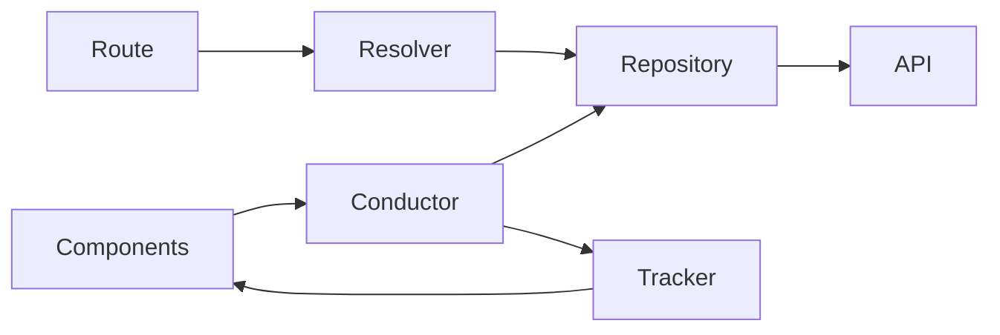

# Angular standards (starter)

Engineering conventions for Angular in this monorepo. This page focuses on **DertInfo-specific** naming and structure — not generic Angular CLI patterns (`.service`, `.pipe`, `.module`, `.component`, route resolvers as a concept, etc.).

**Primary reference:** website client [`apps/dert-web/src/client/`](../../../../apps/dert-web/src/client/).  
The PWA ([`apps/dert-app/`](../../../../apps/dert-app/)) is also Angular/Ionic but uses a different feature layout (pages / services / stores); do not assume the conductor pattern there unless you are deliberately aligning it.

## Client top-level layout (`dert-web`)

Under `src/client/src/app/`:

| Area | Role |
|------|------|
| `core/` | Cross-cutting app infrastructure (auth, guards, base repository, shared core services, logging) |
| `models/` | Client-side types (`dto/`, `app/` view models, auth shapes) |
| `modules/` | Feature areas (e.g. `group-admin`, `event-admin`, `dashboard`) — each owns its UI and section services |
| `regions/` | Route shells / layout regions (authenticated, public, callbacks, …) |
| `shared/` | Reusable UI (components, directives, pipes) shared across features |
| `services/` | Occasional app-wide helpers outside a single feature module |

Standard Angular suffixes (`.component`, `.module`, `.routing`, `.service`, `.pipe`, `.directive`, `.guard`) are used as usual — not restated here.

## Feature section pattern: conductor / tracker / repository / resolver

Within a feature module (example: [`modules/group-admin/`](../../../../apps/dert-web/src/client/src/app/modules/group-admin/)), section behaviour is split into four collaborating types under `services/`:

```
modules/<feature>/
  components/          # views for this section
  services/
    <feature>.conductor.ts
    <feature>.tracker.ts
    <feature>.repository.ts
    <feature>.resolver.ts   # sometimes additional *resolvers for sub-routes
  <feature>.module.ts
  <feature>.routing.ts
```

This is the house pattern across admin/registration/dashboard-style sections. Think of it as close to **MVC / MVVM**:

| Type | File suffix | Analogy | Responsibility |
|------|-------------|---------|----------------|
| **Conductor** | `.conductor.ts` | Controller (MVC) | Orchestrates the section: user/UI actions, when to load, how to update state, navigation/snackbars, calls repository, writes into tracker |
| **Tracker** | `.tracker.ts` | View-model / in-memory state | Holds **client-side** state for the whole section (BehaviourSubjects + memory store); exposes observables/getters for components |
| **Repository** | `.repository.ts` | Data access | HTTP to the API (extends `RepositoryBase`); maps DTOs; **no** long-lived section UI state |
| **Resolver** | `.resolver.ts` | Route preload | Loads the minimum data needed before a route activates (often via repository); keeps components from fetching bootstrap data themselves |

### Data flow



1. **Resolver** (on navigate) may fetch overview (or similar) from the **repository**.
2. **Conductor** takes over for section lifecycle: `init*`, create/update/delete, cache checks (`hasLoaded…`), then assigns results onto the **tracker**.
3. **Components** subscribe to **tracker** streams and call **conductor** methods for actions — they should not talk to the API repository for routine section work.
4. **Tracker** is the source of truth **in the browser** for that section until reset/cleared; **repository** is the path to **server** persistence.

### Example: group admin

| Class | File |
|-------|------|
| `GroupAdminConductor` | `modules/group-admin/services/group-admin.conductor.ts` |
| `GroupAdminTracker` | `modules/group-admin/services/group-admin.tracker.ts` |
| `GroupAdminRepository` | `modules/group-admin/services/group-admin.repository.ts` |
| `GroupAdminResolver` | `modules/group-admin/services/group-admin.resolver.ts` |

Same quartet appears (with feature-specific names) in other modules such as registration-by-group, competition-admin, dashboard, public-content, and dertofderts areas.

### Naming rules

- Prefer `<feature>.conductor.ts` (not a generic `Conductor` class name) so imports stay clear across modules. Some older dertofderts files use short `Conductor` / `Tracker` / `Repository` class names — avoid that in new work.
- Keep the four roles **separate**: do not put HTTP calls in the tracker, or BehaviourSubject section state in the repository.
- Reset/clear section state via conductor → tracker when leaving or switching entity identity (e.g. different group id).

## What this guide deliberately omits

Angular CLI / framework norms (components, modules, pipes, DI providers, Reactive Forms, RxJS basics) — use Angular docs. Expand this standards folder when we add house rules that diverge from those norms (style, testing, NgRx vs conductor, standalone vs NgModule migration, etc.).

## Related

- Website getting started: [`apps/dert-web/README.md`](../../../../apps/dert-web/README.md)
- Architecture overview: [technical/architecture/overview.md](../../architecture/overview.md)
- Documentation guide: [documentation-guide.md](../../../documentation-guide.md)
